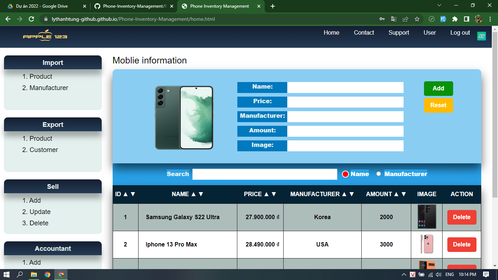

#CASE STUDY MODULE 1 - JAVA SCRIPT - HTML - CSS
# Phone-Inventory-Management
1. Functions:
- show products on table.
- Create a new product.
- Update product.
- Delete product.
- Search product by name or Manufacturer.
- Sort product.
- Login by username + password.
- Register
2. Link product: https://lythanhtung-github.github.io/Phone-Inventory-Management/
3. Account:
- username: admin
- password: admin
4. Image:

